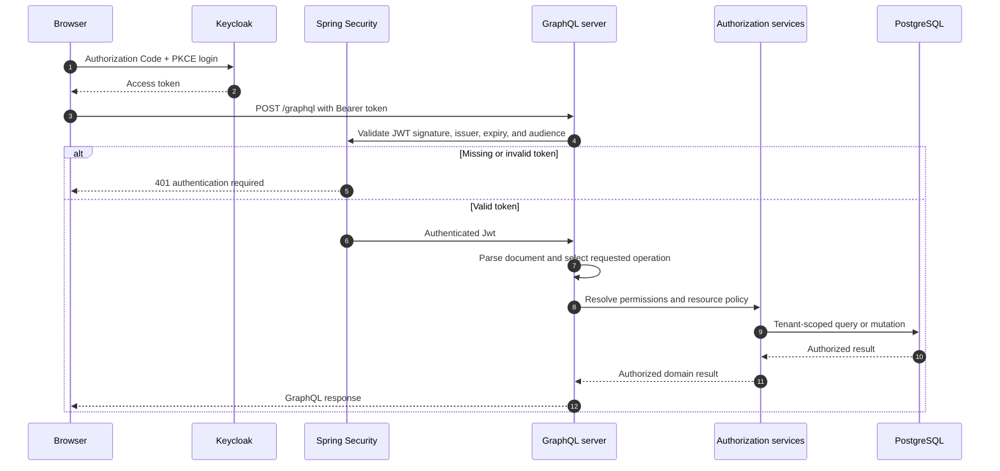
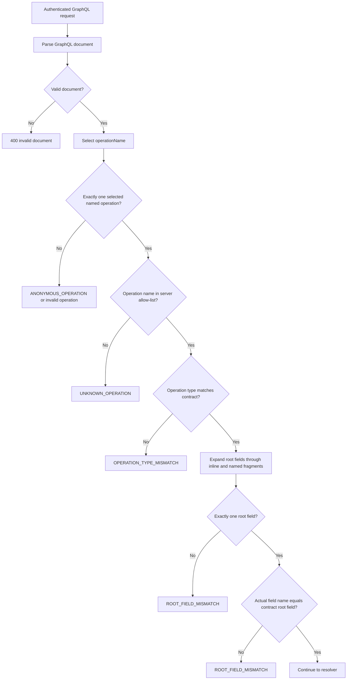
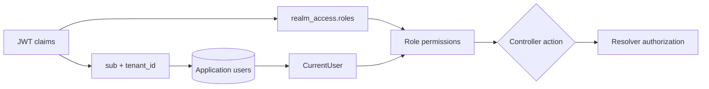
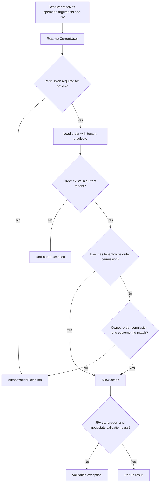
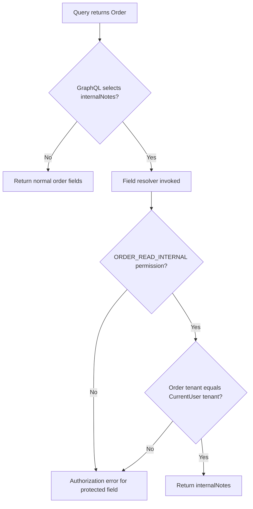

# Server-side architecture and security

This POC keeps authorization on the server. The React client and Keycloak are identity and user-interface layers; they do not decide whether an order may be read, changed, or inspected. A request is accepted only after Spring Security authenticates its bearer token and several GraphQL, permission, tenant, ownership, and field checks succeed.

## Request path



Spring Security is configured as a stateless OAuth2 resource server. Only `/graphql` and preflight requests are exposed; other application endpoints are denied, while `/actuator/health` is allowed for health checks. CORS is limited to the configured frontend origin. Keycloak signs the access token, and the resource server uses the issuer and `graphql-api` audience configuration in `application.yml`.

## GraphQL operation security

A valid token is necessary but not sufficient. Before a resolver runs, `OperationSecurityInterceptor` parses the GraphQL document and validates the selected operation against a server-side contract.



The operation contracts are intentionally narrow:

| Operation | Type | Required root field |
|---|---|---|
| `GetOrder` | query | `order` |
| `GetMyOrders` | query | `myOrders` |
| `GetOrders` | query | `orders` |
| `CreateOrder` | mutation | `createOrder` |
| `UpdateOrder` | mutation | `updateOrder` |
| `CancelOrder` | mutation | `cancelOrder` |
| `DeleteOrder` | mutation | `deleteOrder` |

The policy is structural, not text-based. The interceptor uses the parsed GraphQL AST and compares the selected operation’s actual root field names. An alias such as `result: order(id: "1")` is still treated as `Query.order`; an extra, duplicated, or unexpected root field is rejected. Inline fragments and named fragments are expanded before the root-field count and name checks. Directives are not treated as a way to hide fields from this check, so conditional selections remain conservatively validated.

The default is full structural validation. `NAME_ONLY_OPERATIONS_ENABLED=true` is an intentionally isolated compatibility/demo mode that checks only the operation name; it must not be used as a production security setting. Even in that mode, resolver, tenant, ownership, and field checks still run.

## Identity mapping and role permissions

After the interceptor accepts the operation, the controller resolves the authenticated principal into an application identity. `CurrentUserService` requires the JWT `sub` and `tenant_id`, looks up the user by the immutable Keycloak subject, and verifies that the token tenant matches the database tenant. Roles are read from the Keycloak `realm_access.roles` claim and converted to the server’s `CUSTOMER`, `SUPPORT`, or `ADMIN` enum.



Role permissions are code-based and centralized in `CodeBasedAuthorizationService`:

| Role | Server permissions |
|---|---|
| `CUSTOMER` | Create an order; read, update, and cancel owned orders |
| `SUPPORT` | Read and update all orders in the current tenant |
| `ADMIN` | Read, create, update, cancel, delete, and read internal notes in the current tenant |

Roles do not grant access across tenants. An administrator is an administrator of the tenant in the authenticated token, not a global administrator.

## Resolver and resource authorization

Resolvers apply permissions and resource policy independently of the GraphQL operation name. The general decision flow is:



Examples of the server checks in `OrderController` are:

- `myOrders` queries by both `tenantId` and the authenticated application user ID.
- `orders` first requires `ORDER_READ`, then queries only `tenantId`.
- `order`, `updateOrder`, `cancelOrder`, and `deleteOrder` load by both order ID and `tenantId`; a cross-tenant ID therefore behaves as not found.
- `updateOrder` and `cancelOrder` then require the corresponding permission and ownership fallback.
- `deleteOrder` has no ownership fallback; it requires the tenant-wide delete permission.
- `createOrder` requires `ORDER_CREATE`, loads the current application user, and creates the order in that user’s tenant.

This separation prevents a client from selecting a different tenant or customer in request arguments to bypass the server’s identity context.

## Tenant isolation in persistence

Tenant identity is carried through the authorization service into every order query. The repository deliberately exposes tenant-scoped methods rather than relying on a post-query Java filter:

```text
findByIdAndTenant_Id(id, tenantId)
findByTenant_IdAndCustomer_IdOrderByIdDesc(tenantId, appUserId)
findByTenant_IdOrderByIdDesc(tenantId)
```

The database stores `orders.tenant_id` and relates orders to tenant users. A resource returned by a tenant-scoped query is checked again when a field resolver or resource action needs authorization. This defense in depth is important: a correct resolver check alone should not be the only protection against accidentally using an unscoped repository method.

## Field-level security

`Order.internalNotes` is protected separately from the `Order` object. A GraphQL schema mapping resolves the field only after requiring `ORDER_READ_INTERNAL`, and the resolver repeats the tenant check for the loaded order. Therefore, possessing an order object or selecting the field through an alias or fragment does not automatically grant access.



This is a field authorization boundary, not merely a UI convention. The frontend does not need to omit the field for the server to protect it.

## Failure behavior and boundaries

Authentication failures are transport-level HTTP responses, primarily `401` for missing or invalid bearer tokens. A request with a valid token can still receive a GraphQL response containing structured security errors. Operation-policy failures use an `OPERATION_SECURITY` error category and codes such as `UNKNOWN_OPERATION`, `OPERATION_TYPE_MISMATCH`, and `ROOT_FIELD_MISMATCH`. Resolver and field-policy failures are separate from operation validation.

The architecture demonstrates the core security layers, but production deployment should additionally enforce request-size, query-depth, complexity, batching, subscription, upload, and introspection policies at the HTTP or GraphQL gateway. Those controls are not implied by the operation contract allow-list.

## Server-side security summary

1. **Authentication:** Keycloak issues a token; Spring Security validates it before GraphQL execution.
2. **Operation contract:** The parsed operation must be a known named operation with the correct type and exactly one contract root field.
3. **Identity mapping:** The immutable subject is mapped to an application user and token tenant.
4. **Role permission:** The resolver checks the required permission.
5. **Resource policy:** Tenant and ownership rules decide whether this user can act on this order.
6. **Tenant-scoped persistence:** Database queries include tenant identity, with ownership predicates for customer views.
7. **Field policy:** Sensitive fields such as `internalNotes` have independent permission and tenant checks.
8. **Safe errors:** The server does not expose stack traces or rely on client-side controls for security decisions.
